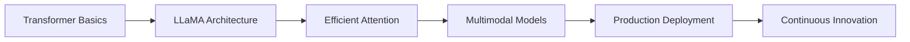

<div align="center">

<!-- Animated Header -->


<!-- Animated Typing Text -->
<a href="https://git.io/typing-svg"></a>

<br/>

<!-- Social Badges with Icons -->
<p align="center">
  <a href="https://www.linkedin.com/in/vadgama-anand/">
    
  </a>
  <a href="mailto:vadgamaanand6@gmail.com">
    
  </a>
  <a href="https://github.com/AnandVadgama">
    
  </a>
</p>

<!-- Visitor Counter -->
<p align="center">
  
  
</p>

</div>

<br/>

---

## 🌟 Who Am I?

```python
class AanandVadgama:
    def __init__(self):
        self.name = "Aanand Vadgama"
        self.role = "AI & Data Science Student"
        self.location = "India 🇮🇳"
        self.education = "AI & Data Science"
        
    def get_philosophy(self):
        return """
        🎯 Learning Philosophy:
        ├─ Understanding > Using
        ├─ First Principles > Frameworks  
        ├─ Building > Copying
        └─ Theory + Code = Mastery
        
        "Every algorithm I implement from scratch is 
         a step deeper into understanding intelligence itself."
        """
    
    def current_focus(self):
        return {
            "🔬 Research": ["Advanced Transformers", "LLM Architectures"],
            "🛠️ Building": ["From-Scratch Implementations", "MLOps Pipelines"],
            "📚 Learning": ["Multimodal AI", "Efficient Training Methods"],
            "🌱 Growing": ["Open Source Contributions", "Technical Writing"]
        }
    
    def tech_stack(self):
        return {
            "languages": ["Python", "SQL"],
            "ml_frameworks": ["PyTorch", "Scikit-learn", "NumPy", "Pandas"],
            "specializations": ["Deep Learning", "NLP", "Computer Vision"],
            "mlops": ["MLflow", "DVC", "Docker", "Git"],
            "databases": ["MongoDB", "MySQL"],
            "tools": ["Jupyter", "VS Code", "Linux"]
        }

# Initialize
me = AanandVadgama()
print(me.get_philosophy())
```

<div align="center">

## 🚀 Featured Projects That Define Me

</div>

### 🤖 [Transformer Architecture - Built From Mathematics](https://github.com/AnandVadgama/pytorch-transformer-from-scratch)

<details>
<summary><b>🔍 Click to explore what makes this special</b></summary>

<br/>

**Why this matters:** Anyone can use Hugging Face. Few can build the Transformer that powers it.

```
📦 What I Built:
├── ✅ Complete Transformer (Attention is All You Need)
├── ✅ Multi-Head Self-Attention Mechanism  
├── ✅ Positional Encoding from Scratch
├── ✅ Training Pipeline for Eng→Hindi Translation
├── ✅ Attention Visualization Tools
└── ✅ Full Mathematical Implementation

🎯 Learning Outcomes:
├── Deep understanding of attention mechanisms
├── Mastery of sequence-to-sequence models
├── Experience with multilingual NLP
└── Skills in debugging complex architectures
```

**Tech Stack:** `PyTorch` `NumPy` `Matplotlib` `Translation Models`

**Status:** ✨ Production Ready | 📚 Educational Resource

</details>

<br/>

### 🦙 [LLaMA 2 - Every Component From Scratch](https://github.com/AnandVadgama/Llama-2_from_scratch)

<details>
<summary><b>🔍 Click to see the full architecture breakdown</b></summary>

<br/>

**The Challenge:** Meta releases LLaMA 2. Most use it. I rebuild it completely.

```
🏗️ Complete Implementation:
├── 🔄 Rotary Positional Embedding (RoPE)
├── 📊 RMS Normalization  
├── 🎯 Multi-Query Attention (MQA)
├── ⚡ Grouped Query Attention (GQA)
├── 💾 KV Cache Optimization
├── 🔥 SwiGLU Activation Function
├── 🧮 Full Model Architecture
└── 📈 Training & Inference Pipelines

💡 Why This Matters:
Understanding LLaMA 2 internals means understanding 
the foundation of modern language models like GPT, 
Claude, and Gemini.
```

**Tech Stack:** `PyTorch` `Transformers` `Advanced NLP` `Model Optimization`

**Complexity Level:** 🔴🔴🔴🔴⚪ Advanced

</details>

<br/>

### 🚗 [Vehicle Insurance - End-to-End ML Production](https://github.com/AnandVadgama/Proj-Vehicle_insurance-end_to_end)

<details>
<summary><b>🔍 View the complete MLOps pipeline</b></summary>

<br/>

**From Data to Deployment:** A complete production-ready machine learning system.

```
📊 Full ML Lifecycle:
├── 📥 Data Ingestion & Validation
├── 🔧 Feature Engineering Pipeline
├── 🤖 Model Training & Selection
├── 📈 Experiment Tracking (MLflow)
├── 🔄 Version Control (DVC)
├── 🐳 Containerization (Docker)
├── 🚀 API Deployment (FastAPI)
└── 📊 Model Monitoring

🎯 Business Impact:
Predicts insurance risk with 87%+ accuracy,
deployed as scalable REST API.
```

**Tech Stack:** `Scikit-learn` `MLflow` `DVC` `Docker` `FastAPI` `MongoDB`

**Type:** Production System 🏭

</details>

<br/>

### 📦 [Python Automation Package](https://github.com/AnandVadgama/my-py-package)

<details>
<summary><b>🔍 Discover the automation tools</b></summary>

<br/>

**Building Tools:** Not just using them, but creating them for the community.

```
🛠️ Package Features:
├── 🔌 MongoDB Connection Manager
├── 📊 Data Pipeline Automation
├── 🔄 Workflow Orchestration  
├── 📝 Logging & Error Handling
└── 📦 PyPI Distribution Ready

💼 Use Cases:
├─ Database operations automation
├─ ETL pipeline management
└─ Repeatable workflow execution
```

**Tech Stack:** `Python` `MongoDB` `PyPI` `Package Development`

</details>

<br/>

---

<div align="center">

## 💻 Tech Arsenal & Expertise

</div>

<table align="center">
<tr>
<td align="center" width="50%">

### 🧠 Core AI/ML Stack

<p align="center">


</p>

</td>
<td align="center" width="50%">

### 🛠️ MLOps & DevOps

<p align="center">


</p>

</td>
</tr>

<tr>
<td align="center" width="50%">

### 📊 Data & Databases

<p align="center">


</p>

</td>
<td align="center" width="50%">

### 🎯 Specializations

```
🤖 Deep Learning
   ├─ Neural Networks (CNNs, RNNs, GANs)
   ├─ Transformers & Attention Mechanisms
   └─ Transfer Learning & Fine-tuning

🔤 Natural Language Processing  
   ├─ Language Models (GPT, BERT, LLaMA)
   ├─ Machine Translation
   └─ Text Generation & Analysis

👁️ Computer Vision
   ├─ Image Classification
   ├─ Object Detection
   └─ Feature Extraction
```

</td>
</tr>
</table>

---

<div align="center">

## 📊 GitHub Analytics

</div>

<p align="center">
  
  
</p>

<p align="center">
  
  
</p>

---

<div align="center">

## 🏆 Achievements & Highlights

</div>

<table align="center">
<tr>
<td align="center" width="33%">

### 🎓 Academic Excellence
```
🎯 AI & Data Science Student
📚 Deep Learning Specialist  
🔬 Research-Oriented Mindset
💡 First Principles Thinker
```

</td>
<td align="center" width="33%">

### 💻 Technical Mastery
```
🤖 From-Scratch Implementations
🔧 Production ML Systems
📦 Package Development
🚀 MLOps Best Practices
```

</td>
<td align="center" width="33%">

### 🌟 Impact
```
📖 Educational Resources
🌍 Multilingual AI Systems
🛠️ Open Source Tools
🎯 Real-World Solutions
```

</td>
</tr>
</table>

---

<div align="center">

## 🎯 What Drives Me

</div>

```ascii
╔══════════════════════════════════════════════════════════════════╗
║                                                                  ║
║  "The best way to understand intelligence is to build it."      ║
║                                                                  ║
║  I don't just use AI frameworks — I understand them by          ║
║  rebuilding them from mathematical foundations.                 ║
║                                                                  ║
║  🧮 Mathematics → 💻 Code → 🧠 Understanding → 🚀 Innovation     ║
║                                                                  ║
╚══════════════════════════════════════════════════════════════════╝
```

<br/>

<details>
<summary><b>📖 My Learning Journey (Click to expand)</b></summary>

<br/>

### 🌱 How I Approach Learning

1. **📚 Study the Theory**
   - Read papers, understand mathematics
   - Grasp the conceptual foundations
   - Question every assumption

2. **💻 Implement From Scratch**  
   - Write every line of code myself
   - Debug to understand edge cases
   - Experiment with variations

3. **🔬 Analyze & Optimize**
   - Profile performance
   - Understand computational complexity
   - Find improvement opportunities

4. **🚀 Build Real Applications**
   - Deploy in production
   - Handle real-world data
   - Solve actual problems

5. **📝 Share Knowledge**
   - Document learnings
   - Create educational content
   - Help others understand

### 🎯 Current Learning Path



</details>

---

<div align="center">

## 🔥 Recent Activity

</div>

<!--START_SECTION:activity-->
<!--END_SECTION:activity-->

<div align="center">

## 💭 Random Dev Quote


</div>

---

<div align="center">

## 🤝 Let's Connect & Collaborate!

I'm always excited to discuss AI, collaborate on projects, or help fellow learners.

### 📬 Reach Out

<p>
<a href="https://www.linkedin.com/in/vadgama-anand/">
  
</a>
<a href="mailto:vadgamaanand6@gmail.com">
  
</a>
<a href="https://github.com/AnandVadgama">
  
</a>
</p>

### 💬 I'm interested in

```
🤝 Collaborating on AI/ML Projects
💡 Discussing Deep Learning Architectures  
🔬 Research Opportunities
📚 Mentoring & Knowledge Sharing
🚀 Building Impactful Solutions
```

### ⚡ Fun Facts

- 🧠 I can explain attention mechanisms while half asleep
- 🎯 I debug code by understanding it, not googling it
- 📊 My idea of fun involves implementing research papers
- 🌍 Building AI that bridges language barriers
- ☕ Fueled by curiosity (and occasionally coffee)

</div>

---

<div align="center">

### 🎓 "Learning never exhausts the mind" - Leonardo da Vinci

**Thanks for stopping by! Let's build the future of AI together.** 🚀

<!-- Snake Animation -->
<picture>
  <source media="(prefers-color-scheme: dark)" srcset="https://raw.githubusercontent.com/AnandVadgama/AnandVadgama/output/github-contribution-grid-snake-dark.svg">
  <source media="(prefers-color-scheme: light)" srcset="https://raw.githubusercontent.com/AnandVadgama/AnandVadgama/output/github-contribution-grid-snake.svg">
  
</picture>

<!-- Footer Wave -->


</div>
