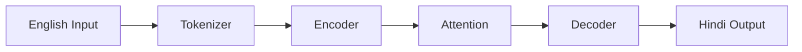
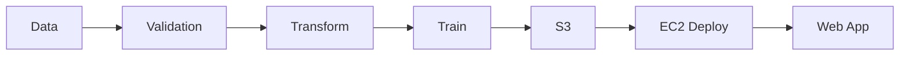

<div align="center">

<!-- Animated Header with Gradient Wave -->


<!-- Multiple Animated Typing Lines -->
<a href="https://git.io/typing-svg">
  
</a>

<!-- Animated Divider -->


<!-- Enhanced Social Badges with Hover Effects -->
<p align="center">
  <a href="https://www.linkedin.com/in/vadgama-anand/">
    
  </a>
  &nbsp;
  <a href="mailto:vadgamaanand6@gmail.com">
    
  </a>
  &nbsp;
  <a href="https://github.com/AnandVadgama">
    
  </a>
</p>

<!-- Profile Stats Badges -->
<p align="center">
  
  &nbsp;
  
</p>


</div>

<br/>

<!-- About Me Section with Code Block -->
##  About Me


```python
class AnandVadgama:
    """
    🎓 AI & Data Science Enthusiast | 🇮🇳 India
    Building AI from Mathematics to Production
    """
    
    def __init__(self):
        self.name = "Anand Vadgama"
        self.role = "AI & Deep Learning Engineer"
        self.philosophy = "Understanding > Using"
        
    def current_focus(self):
        return [
            "🤖 Transformer Architectures from Scratch",
            "🦙 LLaMA 2 Implementation",
            "🚀 End-to-End ML Production Systems",
            "📦 Python Package Development"
        ]
    
    def approach(self):
        return "First Principles → Implementation → Mastery"
```

<br clear="right"/>

<div align="center">


## 🚀 Featured Projects


</div>

<br/>

<!-- Project 1: Transformer -->
###  [Transformer from Scratch](https://github.com/AnandVadgama/pytorch-transformer-from-scratch)

<div align="center">


</div>

<details>
<summary><b>🔍 Click to see implementation details</b></summary>

<br/>

> **Complete PyTorch implementation of the Transformer architecture for English-to-Colloquial Hindi translation.**

```
📦 Architecture Components:
├── ✅ Multi-Head Self-Attention Mechanism
├── ✅ Positional Encoding (Sinusoidal)
├── ✅ Encoder-Decoder Stack (N layers)
├── ✅ Source & Target Embeddings
├── ✅ Projection Layer
└── ✅ Attention Visualization Tools

📁 Repository Structure:
├── model.py          → Full Transformer implementation
├── train.py          → Training loop & checkpointing
├── inference.py      → Interactive inference script
├── attention_visual.ipynb → Attention map visualization
└── tokenizer_*.json  → Pretrained tokenizers
```



**🎯 Key Achievement:** Built the complete "Attention is All You Need" paper implementation from scratch!

</details>

<br/>

---

<!-- Project 2: LLaMA 2 -->
###  [LLaMA 2 from Scratch](https://github.com/AnandVadgama/Llama-2_from_scratch)

<div align="center">


</div>

<details>
<summary><b>🔍 Click to explore the LLaMA 2 architecture</b></summary>

<br/>

> **Full implementation of LLaMA 2 featuring cutting-edge components for modern language models.**

```
🏗️ LLaMA 2 Components Implemented:
├── 🔄 Rotary Positional Embedding (RoPE)
├── 📊 RMS Normalization
├── 🎯 Multi-Query Attention (MQA)
├── ⚡ Grouped Query Attention (GQA)
├── 💾 KV Cache for Fast Inference
├── 🔥 SwiGLU Activation Function
└── 🧮 Complete Model Architecture (7B params structure)

📁 Project Structure:
├── model.py         → Full LLaMA 2 architecture
├── inference.py     → Inference with KV caching
├── download.sh      → Model weights downloader
└── llama-2-7b/      → Weights & configurations
```

**💡 Why This Matters:** Understanding LLaMA 2 internals = Understanding the foundation of GPT, Claude, and Gemini!

</details>

<br/>

---

<!-- Project 3: Vehicle Insurance -->
###  [Vehicle Insurance - End-to-End ML](https://github.com/AnandVadgama/Proj-Vehicle_insurance-end_to_end)

<div align="center">


</div>

<details>
<summary><b>🔍 View the complete MLOps pipeline</b></summary>

<br/>

> **Production-ready ML pipeline for predicting vehicle insurance outcomes with full cloud deployment.**

```
⚙️ End-to-End ML Lifecycle:
├── 📥 Data Ingestion & Validation
├── 🔧 Data Transformation Pipeline
├── 🤖 Model Training & Evaluation
├── ☁️ AWS S3 Model Storage
├── 🚀 AWS EC2 Deployment
├── 🔄 CI/CD with GitHub Actions
└── 🌐 FastAPI Web Application

🛠️ Tech Stack:
├── scikit-learn    → ML Algorithms
├── FastAPI         → REST API
├── AWS S3/EC2      → Cloud Infrastructure
├── Docker          → Containerization
└── GitHub Actions  → CI/CD Pipeline
```



**🎯 Production System:** Real-time predictions via deployed web interface!

</details>

<br/>

---

<!-- Project 4: Python Package -->
###  [Auto Connect MongoDB Package](https://github.com/AnandVadgama/my-py-package)

<div align="center">


</div>

<details>
<summary><b>🔍 Explore the automation features</b></summary>

<br/>

> **Python package for seamless MongoDB operations with CSV/Excel bulk insert support.**

```
✨ Package Features:
├── 🧩 Simple MongoDB Client Management
├── 📥 Single & Multiple Record Inserts
├── 📊 Bulk Insert from CSV/Excel
├── ☁️ MongoDB Atlas Support
├── 🔍 Find, Update, Delete Operations
└── 🏷️ Type-Annotated & Tested

📦 Installation:
pip install Auto_connect_mongo

🔧 Quick Usage:
from Auto_connect_mongo.mongo_crud import mongo_operation
mongo = mongo_operation(uri, db, collection)
mongo.insert_record({"name": "AI"}, collection)
mongo.bulk_insert("data.csv", collection)
```

**📦 Building Tools, Not Just Using Them!**

</details>

<br/>

---

<div align="center">


## 💻 Tech Stack & Skills


</div>

<br/>

<table align="center">
<tr>
<td align="center" width="50%">

### 🧠 AI & Deep Learning

<p align="center">

</p>

<p align="center">

&nbsp;&nbsp;

&nbsp;&nbsp;

</p>

```
🔥 PyTorch - Deep Learning
📊 NumPy & Pandas - Data
📈 Scikit-learn - ML
🎨 Matplotlib & Seaborn
```

</td>
<td align="center" width="50%">

### 🛠️ MLOps & Tools

<p align="center">

</p>

<p align="center">

&nbsp;&nbsp;

</p>

```
🐳 Docker - Containers
☁️ AWS S3/EC2 - Cloud
⚡ FastAPI - APIs
🔄 Git & CI/CD
```

</td>
</tr>
<tr>
<td align="center" width="50%">

### 📊 Databases

<p align="center">

</p>

```
🍃 MongoDB & Atlas
🐬 MySQL
📦 Data Pipelines
```

</td>
<td align="center" width="50%">

### 🎯 Specializations

```
🤖 Transformers & Attention
🦙 Large Language Models
📈 End-to-End ML Pipelines
📦 Python Package Dev
🚀 Production Deployment
```

</td>
</tr>
</table>

<br/>

<div align="center">


## 📊 GitHub Stats


<!-- GitHub Stats Cards -->
<p align="center">
  
  
</p>


<!-- Activity Graph -->


</div>

---

<div align="center">

## 🎯 My Philosophy

```
╔═══════════════════════════════════════════════════════════════════════════════╗
║                                                                               ║
║   "The best way to understand intelligence is to build it from scratch."     ║
║                                                                               ║
║   🧮 Mathematics → 💻 Code → 🧠 Understanding → 🚀 Innovation                  ║
║                                                                               ║
╚═══════════════════════════════════════════════════════════════════════════════╝
```


## 🤝 Let's Connect!

<p align="center">
  <a href="https://www.linkedin.com/in/vadgama-anand/">
    
  </a>
  &nbsp;
  <a href="mailto:vadgamaanand6@gmail.com">
    
  </a>
  &nbsp;
  <a href="https://github.com/AnandVadgama">
    
  </a>
</p>

### 💬 Open to

```
🤝 AI/ML Collaborations     📚 Knowledge Sharing
💡 Research Discussions     🚀 Innovative Projects
```

<br/>


<em><b>Let's build the future of AI together!</b></em>


<br/><br/>

<!-- Snake Animation - Setup Required -->
<picture>
  <source media="(prefers-color-scheme: dark)" srcset="https://raw.githubusercontent.com/AnandVadgama/AnandVadgama/output/github-contribution-grid-snake-dark.svg">
  <source media="(prefers-color-scheme: light)" srcset="https://raw.githubusercontent.com/AnandVadgama/AnandVadgama/output/github-contribution-grid-snake.svg">
  
</picture>

<br/><br/>

### ⭐ "Learning never exhausts the mind" - Leonardo da Vinci

<br/>

<!-- Footer Wave -->


</div>
